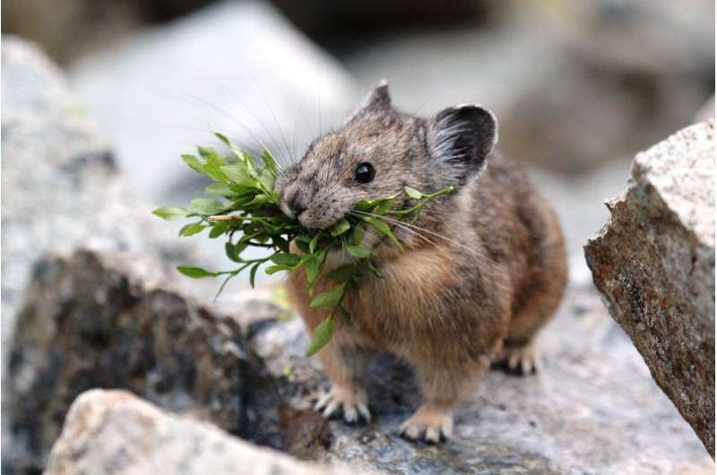

## ESIIL Test Student
Hi, I'm the **ESIIL** test student for 2024. I work with [Earth Lab](https://earthlab.colorado.edu/) and [ESIIL](https://esiil.org/) at CU in Boulder, Colorado (USA). *I'm excited to work with you!*

##### Images of me
<table>
    <td> 
        
    </td>
    <td>
        
    </td>
</table>

#### Contact Information
* GitHub
* LinkedIn
* Twitter

#### Educational Background

#### Experience

#### Exciting things about me

#### Check out some of my work
* [Temperature changes at Many Glacier, MT (1980-2020)](notebook/many-glacier.html)
  
  
  

* [Changes in vegetation health at Glacier National Park (2015-2020)](notebook/glacier-park-ndvi.html)
  
  

#### Map of Glacier National Park
<embed type="text/html" src="img/glacier-national-park.html" width="600" height="600">
